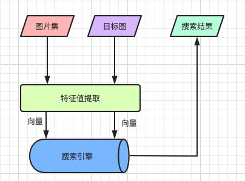

## 图像搜索流程

- 按照某种算法计算图像特征值
- 构建特征值库
- 计算目标图像特征值
- 在特征值库中检索
- 返回搜索结果

## 图像特征定义

1. 抽象的数值、向量或者符号
2. 可描述图像内容、特点
3. 可对比计算或者度量

## 特征值提取

1. 感知哈希 - 对整体描述
2. SIFT算法 - 局部特征，人为设计的算法，传统特征提取
3. CNN - 机器学习方式提取局部特征
4. Haar小波变换 - 也是对图像的整体性描述

## 相似性度量

通过特征值判断图像的相似性，通常采用的方法就是计算特征值间的“距离”(Distance)或者相似度

1. 汉明距离
2. 欧氏距离
3. 夹角余弦

## 向量检索

### 检索方法

1. 空间切分
2. 近似图

### 检索库

1. Faiss - Facebook开源的一个高性能的高维向量相似度检索和聚类库, C++编写
2. Milvus -集成了 Faiss、NMSLIB、Annoy 等广泛应用的向量索引库，上手简单。号称十亿高维向量秒级查询, 重点推荐
3. PostgreSQL + 插件
4. ES + 插件

## 工程实践

### PG在图像搜索中的应用

- pg + cube/imgsmlr插件

### 一亿图像秒级搜索优化之路

#### 优化背景

1. 阿里云pg 高版本不支持imgsmlr插件，只有 9.4版本支持，
2. 云数据库参数不能自行调整。
3. pg 9.4版本不支持并行查询，阿里云pg库参数不能自行调整, 向量检索性能很低

#### 优化之道

1. 源码编译安装PG 12.3版本
2. 图片特征值建立分区表 
3. pg dblink并行查询
4. 数据预热到内存，减少磁盘IO

#### 优化结果

1. 中等配置服务器 CPU 16核 内存16G
2. 图片特征值16分区表, 单分区返回十条记录
3. 千万级图片100ms返回结果
4. 一亿图片1000ms以内返回结果

## 参考文档

1. https://segmentfault.com/a/1190000022208225
2. https://segmentfault.com/a/1190000022341617
3. https://segmentfault.com/a/1190000022842774
4. https://segmentfault.com/a/1190000021754881?utm_source=tag-newest
5. https://github.com/zilliztech/milvus/blob/master/README_CN.md
6. https://milvus.io/cn/docs/overview.md
7. https://github.com/milvus-io/bootcamp/tree/master/solutions/pic_search
8. https://mp.weixin.qq.com/s/1sN689CO_JWRzXZx9V-bUQ
9. https://developer.aliyun.com/article/748117
10. https://zhuanlan.zhihu.com/p/90677337
11. http://yongyuan.name/blog/CBIR-BoW-for-image-retrieval-and-practice.html
12. https://www.zhihu.com/question/22039410
13. https://www.zhihu.com/question/24453478